# Lab 02 - Custom Connectors 

In this lab, you will go through the following tasks:

* Create a solution
* Create a connector in the solution
* Setup authentication
* Add operation with Parameters

## Task 1: Create a solution
Best Practice for everything in the Power Platform: Work INSIDE solutions. They are great for organizing your customizations and some features only work here plus they over ALM capabilities.

Because of that our first step withing **make.powerautomate.com** is to navigate to **Solutions** on the left hand side and click on **New Solution**

In the dialog which open give your solution a meaningful name and select either create an own publisher by clicking **New** and fill in Name and Prefix.

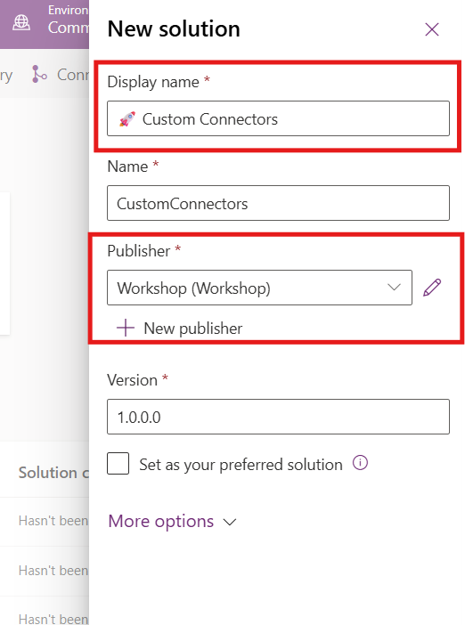

Sidenote: Using the Default Publisher is not considered best practice because you have no control about the technical prefix all your components will receive.

Congrats you have a solution for doing our Custom Connector development! Every journey starts with the first step 💪

## Task 2: Create a connector from blank
As we learned before there are multiple ways to create a Custom Connector, we will use the most basic one to learn the basics 🙂

Inside your solution click on **New** and in the menu on **Automation** and then on **Custom Connector**

### General Definition
In a new tab the Custom Connector edit wizard will be opened in the first step.

First step is given your Custom Connector a meaningful name, make sure to use a name your users will understand, this will show up in all UIs. Bonus points if you also add an icon below under **General Information**

Next you need to select **HTTPS** and fill in the **Host** and **Base URL**. The Community API can be reached under the following url:

**https://apim-dhino-fetch-prod-004.azure-api.net/004**

Make sure to split this url and add the base url without the **https://** and **/004** as base url. The **Host url** is always the url to the top-level domain. The **Base Url** is the following part of the url that will be added to each request.

## Task 3: Define Security / Authentication
Click on **Security** on the bottom or in the wizard status on top to move on to the next step. Authentication describes how the Custom Connector will authenticate with the API and the options to choose from depends on the used API.

For the Community API the authentication is done via an **API Key**, so select this option 

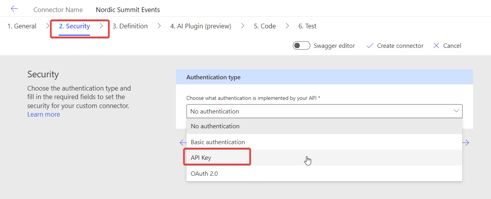

After selecting you will asked to enter the label, name and location of parameter.

**Label:** This will be shown to the user when creating a new connection, shows a readable meaningful name

**Name:** This is the technical defined **by the API** so you can be creative here!

**Location:** This defines where the Custom Connector will add the API Key information when making requests. 

The Community API will be authenticated by an API Key in the Header of each HTTP Request called **Ocp-Apim-Subscription-Key**

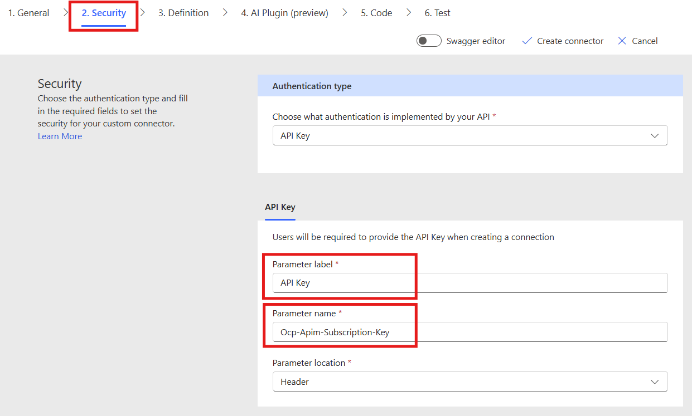

All done! Very important: **You do not need to enter any API Key in this step!** Authentication info is never stored directly in a Custom Connector but only ever in Connections. They will get created later when we are actually are using our Custom Connector.

## Task 4: Create first simple definition
Click on **Definition** to get to the next step of creating a Custom Connector, the stage where we define the actual actions which are possible to execute for this Custom Connector.

In this screen you see all actions, triggers, references and policies you have added to your connector. Since we create from Blank this screen will be empty.

Let's change that by adding our very first action by clicking on **New Action**

Creating an action consists of three steps:
- Naming / Description
- Request definition
- Response definition

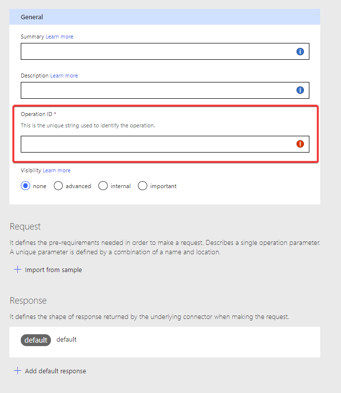

### Naming / Description
As a minimum you need to enter a unique id for this action. Choose a name which is easily recognizable and not a typical "id" because later on other actions use this id to refer to it.

We want to call the Community API to get a list of all available events, which we can call it with a **GET** request to this url:
**https://apim-dhino-fetch-prod-004.azure-api.net/004/export/query/02C23311-6C39-49EF-A80A-F6B8692C045E/BFBE4129-0463-4DE5-A0AB-38A6B32AF9BA/EVENTS**

The two GUIDs in the URL are referencing the environment we want to target and we will consider them static for now, they point to the Workshop database

### Request
Pick an id for this operation and we will go on the **Request** part of it. 

The wizard has a great feature called **Import from Example** where you can copy paste an existing request (for example from documentation or lab instructions on GitHub), an the wizard will extract all needed information.

In the opened dialog fill in the URL and HTTP method from above. Since this is a simple request with no further information you are all set to go and can click **Import**

Congrats, your connector has its first action! 🥳 Let's quickly test if we did all steps correctly so far.

### Saving and Testing
In order to test a Custom Connector you always have to save it first. If it's the first time it will actually create the Custom Connector. Do this by clicking **Create Connector**. This will deploy all resources needed in the backend and can sometimes take a bit.

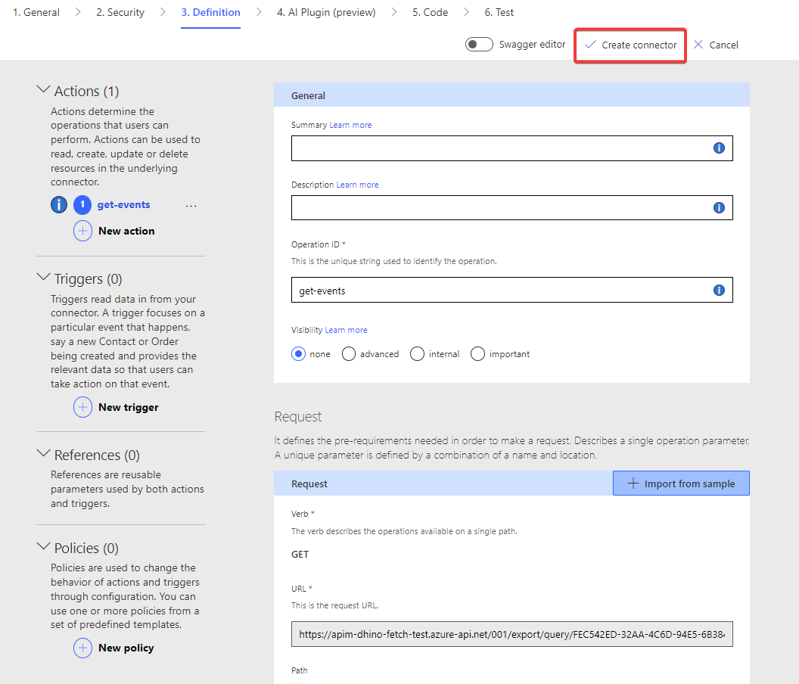

After the Creating is done and the loading screen is gone we can skip ahead in the Wizard navigation and jump to the final stage **Test**

Because the connector is newly created there is no Connection yet so in order to test it we first need to create one by clicking on **New Connection**

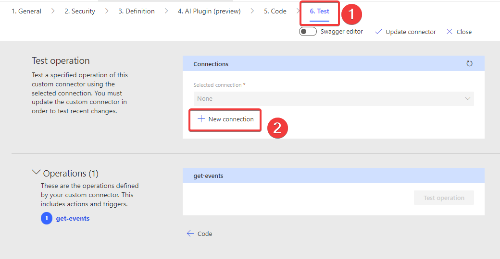

This will open a new tab where you have the default Create New Connection interface like for all connectors. Which fields are shown is dependent on the selected authentication method. In our case this is the API key. Recognize the name of this field? That's the label we defined in the **Security** step! Click **Create Connection** to create it.

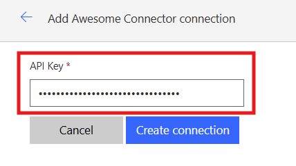

You will be redirect to the test screen. If the **Connection** field is still empty, click on the **Refresh** button and your newly created connection shows up.

With that we are ready to test! On the left hand you can select the action, and since we only have one which has no parameter you can click directly on **Test**

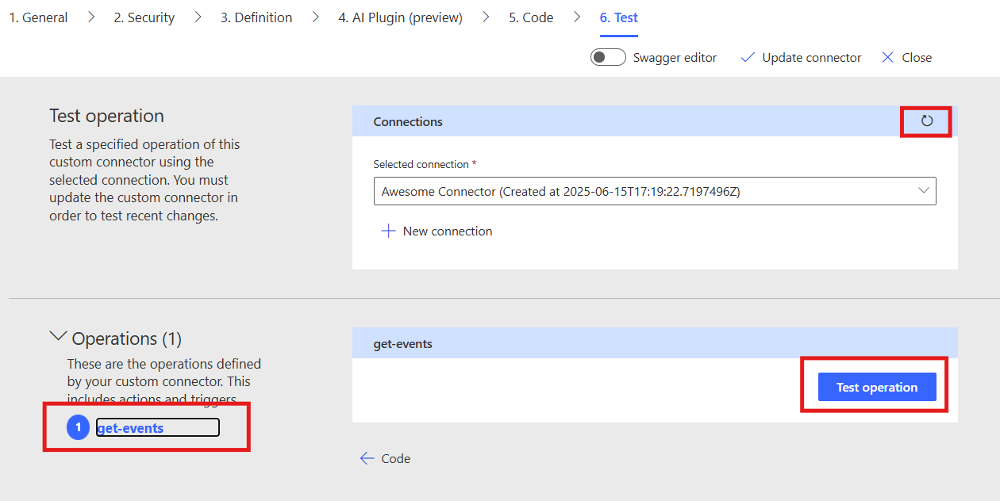

If all is set up correct and the connection has the right API Key you will see the result of that API call with a HTTP status 200.

First call made by your Custom Connector to the Community API!

We will do one more step though, as you might noticed we skip one step in the definition part, the definition of the **Result** of our operation. Since we now have the result JSON let's add it!

### Result of operation
Copy the body from your test execution of the operation.

Afterwards we navigate back to **Definition** of the wizard. Here navigate down to the **Response** area and click on **Add Default Response**

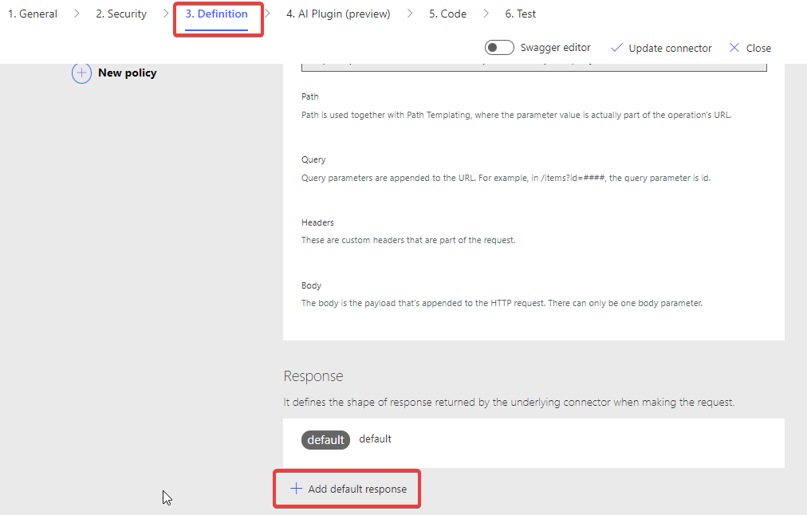

This will open again a dialog where you can define the expected result by copying a demo result. Good that we have one now! We only care about the body of this result for this API so copy the response into the **Body** field. The Dialog will now parse the JSON Object and store its schema (similar to the **Parse JSON** action in Power Automate!)

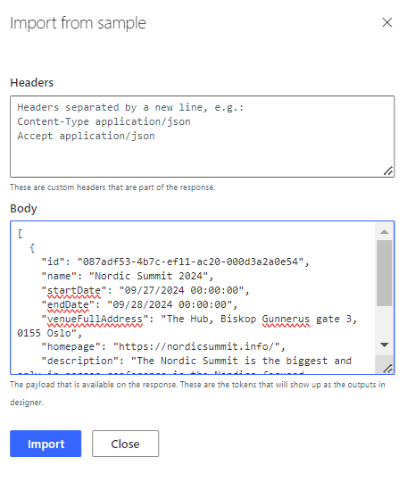

To see the result click on the **Default Response** in the main screen.

In the detail screen we now see that the Custom Connector knows about all the fields which are returned from the action.

This is very important and **strongly** recommended to set up for all your actions. If you don't this, when a user calls this action in any UI (Power Automate, Power Apps, etc.) they will only get a JSON object and have to do all parsing themselves. This way the structure is already stored in the Custom Connector and can be directly used. This will be important in the following steps. 

Also remember to **Update Connector** to publish your changes!

## Task 5: Create an operation with parameter
Let's get into the more interesting stuff, let's make more dynamic operations. You saw that the GET/Events returning multiple events, so let's check out the connected records for different events. For this we will add **Tracks** and **Sessions** with the goal of getting only session of a certain track of a certain event.

For that we will need the Tracks first so let's start with them!

### GET/Tracks by Event
Follow the same steps as we did in the first operation, starting on the **Definition** screen and click on **New Action**

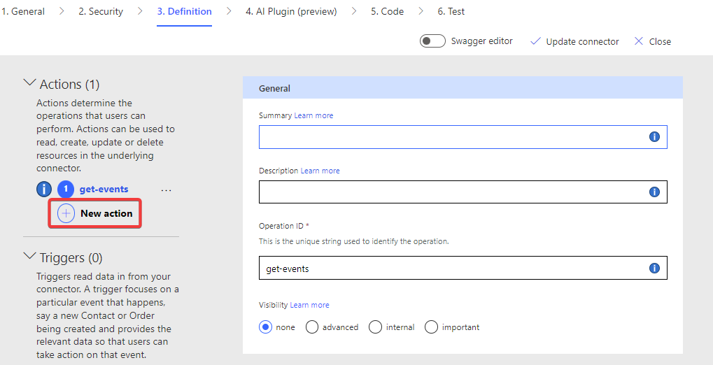

The Community API offers the following GET endpoint which returns the tracks filtered on an event. The ids for the events you get with the previous operations **get-events**.

Here as an example for the demo event **Community Summit**:

**https://apim-dhino-fetch-prod-004.azure-api.net/004/export/query/02C23311-6C39-49EF-A80A-F6B8692C045E/BFBE4129-0463-4DE5-A0AB-38A6B32AF9BA/TRACKS?filter=f4468a50-cbc9-ef11-b8e8-000d3ab15f3b** 

This is the endpoint for event **EPPC 25**:

**https://apim-dhino-fetch-prod-004.azure-api.net/004/export/query/02C23311-6C39-49EF-A80A-F6B8692C045E/BFBE4129-0463-4DE5-A0AB-38A6B32AF9BA/TRACKS?filter=d726aa09-0e4a-f011-877a-6045bdde7236**

The only difference between the calls is the query parameter **filter**. To tell the custom connector this part is a dynamic paramter we need to enclose it with brackets { }. For the get-tracks use the sample GET request to the following URL **https://apim-dhino-fetch-prod-004.azure-api.net/004/export/query/02C23311-6C39-49EF-A80A-F6B8692C045E/BFBE4129-0463-4DE5-A0AB-38A6B32AF9BA/TRACKS?filter={eventId}** Here the specific id of the event is replaced with a parameter.

So our first step is adding an action which takes one parameter. For that we go to **Definition** and add another action, give it an id, and use the **Import From Sample** function.Copy the URL from above, but this we modify the URL and mark which part should be a parameter. This is done by replacing the text with "{PARAMETERNAME}", so if we want to add a parameter named "trackid" we use the following URL:

***https://apim-dhino-fetch-prod-004.azure-api.net/004/export/query/02C23311-6C39-49EF-A80A-F6B8692C045E/BFBE4129-0463-4DE5-A0AB-38A6B32AF9BA/TRACKS?filter={eventId}**

After clicking on **Import** you directly see that our request now has a parameter:

If you click on the parameter and select **Edit** you can check it's properties. We have a lot of options here, for now let's just set it to **Required = Yes** because without a value the API will error out.

Follow the same steps as we did for the GET/EVENTS, but this in the testconsole you will see the parameter **filter**, enter an event id from GET/Events and click on **Test Operation**

Like we did before copy these and add them as the **Default Response** in the definition screen for the Tracks action. If you click on the Default Action afterwards the properties should be parsed like this:

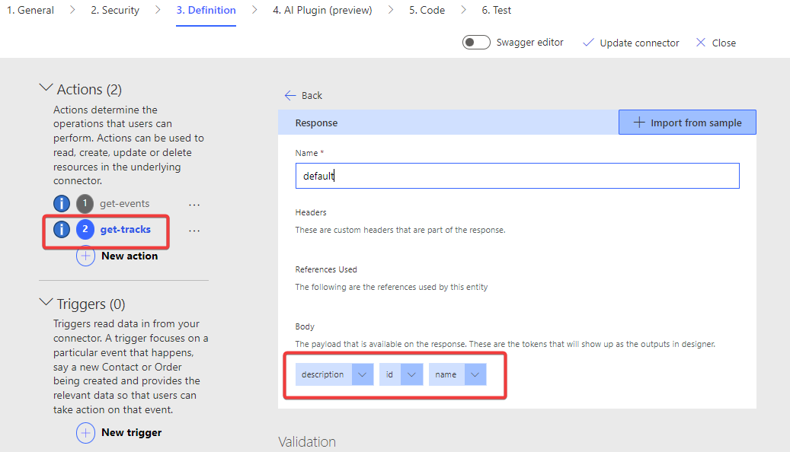

Tip: Make sure to select the correct action on the left hand side before Import the Default Response, or you might risking overwriting the response of the first action.

### GET/Session By Track  
Next we want to add an operation which gets us all the session for one track. The Community API offers the following GET endpoint, here as an example for the event **Community Event**

Track **Dynamics 365**:

**https://apim-dhino-fetch-prod-004.azure-api.net/004/export/query/02C23311-6C39-49EF-A80A-F6B8692C045E/BFBE4129-0463-4DE5-A0AB-38A6B32AF9BA/SESSIONSBYTRACK?filter=dc3486eb-d3c9-ef11-b8e8-0022489f4ced** 

Track **Power Platform**:

**https://apim-dhino-fetch-prod-004.azure-api.net/004/export/query/02C23311-6C39-49EF-A80A-F6B8692C045E/BFBE4129-0463-4DE5-A0AB-38A6B32AF9BA/SESSIONSBYTRACK?filter=77768be5-d3c9-ef11-b8e8-0022489f4ced**

The dynamic part of this request is the part after the "?filter=" followed by the **Id** of a track.

Add this operation the same way you did for the **GET/Tracks** operation!

After this let's test our new function! **Update Connector** and move to the **Test** screen and select the new action. You see that we now have a parameter field and can add an Id for a track. Test the Tracks action first to get the ids and then test it with the new action.

This works pretty well! But obviously this not an ideal user experience, you need to know very cryptic GUIDs and there is no support on how to enter them. This is one of the limits of the current Custom Connector UX. The UX is better in Power Automate

## Bonus Task 1:

**Challenge** Test the UX in Power Automate!

For this build a flow that iterates through all the events, and per events through all sessions by track.